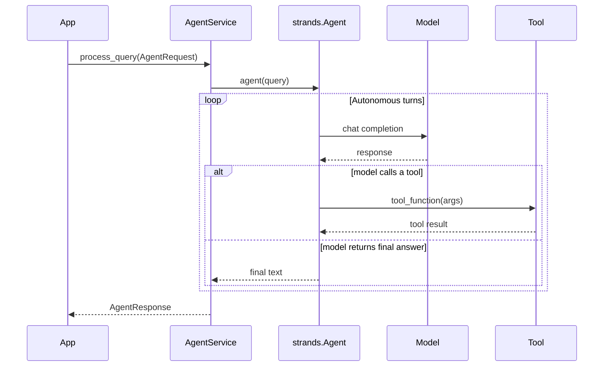

# foundry-strands-agent


AWS Strands SDK adapter that implements the `foundry-agent-core`
protocol surface. The core feature is an autonomous agent loop:
`AgentService` receives a query, creates a `strands.Agent` with the
configured tools, and lets the agent decide which tools to call and when
to stop. Multiple model providers (Bedrock, Ollama, LlamaCpp, NIMS),
session persistence (file or S3), MCP server integration, and A2A
agent-to-agent communication are all wired through a single,
protocol-based factory.

## Install

Install a released wheel from this repo's
[GitHub Releases](https://github.com/boozallen/foundry-agent-packages/releases).
See [docs/foundry/releases/adopting.md](../../releases/adopting.md) for
the full flow - pinning a release URL directly for evaluation, or
hosting the wheel in your own index for production, plus verifying the
SBOM/scan assets.

Requires AWS credentials (Bedrock), a running Ollama instance, a
LlamaCpp server, or a NIMS / OpenAI-compatible endpoint.

## Quickstart

```python
import asyncio
from foundry_strands_agent import (
    StrandsAgentConfig,
    create_agent_service,
    create_default_container,
)
from foundry_agent_core import AgentRequest

async def main():
    config = StrandsAgentConfig()  # default: bedrock + claude-sonnet-4
    container = create_default_container(config)

    service = create_agent_service(container)
    async with service.service_lifecycle():
        request = AgentRequest(session_id="demo-session-01", query="What is 2 + 2?")
        response = await service.process_query(request)
        print(response.content)

asyncio.run(main())
```

### Switching providers

```python
from foundry_strands_agent import StrandsAgentConfig, AgentModelConfig

config = StrandsAgentConfig(
    model=AgentModelConfig(
        provider="ollama",            # or "llamacpp", "nims"
        model_id="llama3.1",
        ollama_url="http://localhost:11434",
    )
)
```

### Streaming

This replaces the `response = await service.process_query(request)` line in
the Quickstart `main()` above — it is not a standalone script, since it
reuses the same `service` and `request`:

```python
async for event in service.process_query_stream(request):
    if event["type"] == "token":
        print(event["content"], end="", flush=True)
```

## The agent loop



The agent decides which tools to call and when it has enough context to
return a final answer. The orchestrator applies a configurable timeout
and hands the raw agent output to `DefaultResponseProcessor`, which
extracts text, scores confidence, and normalizes the response.

## What's in the box

| Surface | Highlights |
|---------|------------|
| Services | `AgentService`, `create_agent_service`, `create_default_container`, `QueryOrchestrator`, `DefaultResponseProcessor` |
| Config | `StrandsAgentConfig`, `AgentModelConfig`, `ModelGuardrailConfig`, `StrandsSessionManagerType` |
| Factories | `StrandsAgentFactory`, `AgentToolRegistryManager`, `AgentFactory`, `AgentToolRegistry` |
| Sessions | `ChatHistorian`, `ChatHistoryManager`, `create_chat_history_manager` |
| Lifecycle | `RequestLifecycleManager`, `ExecutionStrategy`, `ExecutionContext`, `RetryPolicy`, `RetryContext` |
| Exceptions | `AgentServiceError`, `AgentServiceInitializationError`, `AgentServiceShutdownError` |

## Security

- **Session IDs** validated against pattern `^[A-Za-z0-9_-]+$` with 8-128 character length constraints (DISA STIG V-222609)
- **TLS 1.2+** enforced on all outbound HTTPS (NIMS, MCP, A2A, Bedrock) with `CERT_REQUIRED` (DISA STIG V-222596)
- **File-backed sessions** encrypted with AES-256-GCM via `SESSION_ENCRYPTION_KEY` (DISA STIG V-222588 / V-222589)
- **Session destruction** via `ChatHistoryManager.on_logoff(session_id)` (DISA STIG V-222578)

## Reference

- [README](https://github.com/boozallen/foundry-agent-packages/blob/develop/packages/foundry-strands-agent/README.md)
- [Changelog](https://github.com/boozallen/foundry-agent-packages/blob/develop/packages/foundry-strands-agent/CHANGELOG.md)
- [Source](https://github.com/boozallen/foundry-agent-packages/tree/main/packages/foundry-strands-agent)
- [License (Apache-2.0)](https://github.com/boozallen/foundry-agent-packages/blob/develop/LICENSE)
