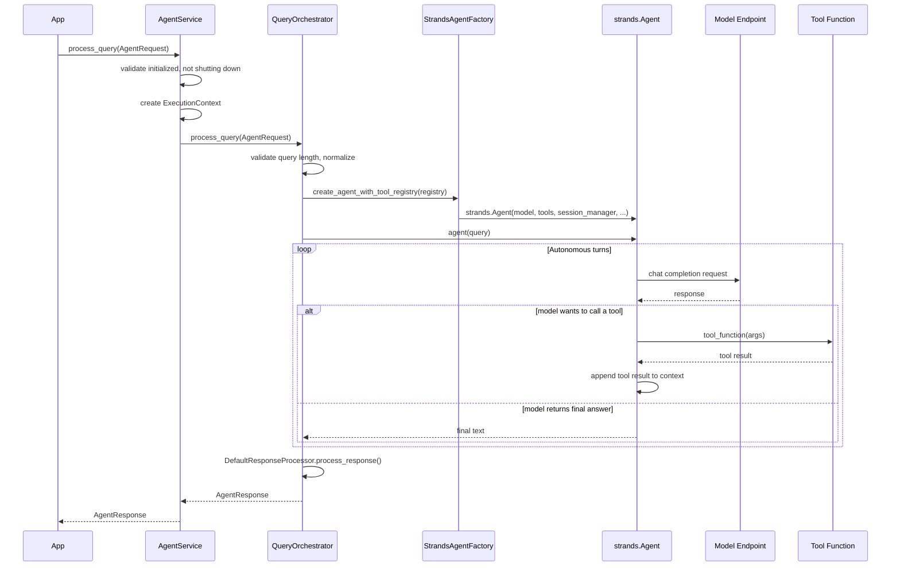

# Agent Loop

Full sequence from `process_query` call to final `AgentResponse`.

The agent loop is fully autonomous — `strands.Agent` decides which tools to
call and when it has enough context to return a final answer.  The orchestrator
applies a configurable timeout and hands the raw agent output to
`DefaultResponseProcessor`, which extracts text, scores confidence, and
normalises the response before returning it to the caller.
