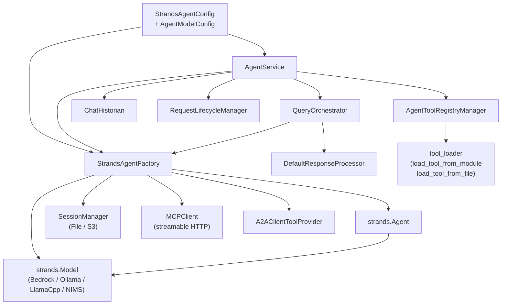

# Component Map

Internal structure of `foundry-strands-agent`.

**Configuration** flows top-down: `StrandsAgentConfig` initialises
`StrandsAgentFactory`, which assembles a `strands.Agent` from the selected
model, session manager, MCP clients, and A2A providers.  `AgentService`
coordinates the full pipeline — it owns the lifecycle manager, delegates
query orchestration to `QueryOrchestrator`, and exposes chat history through
`ChatHistorian`.
