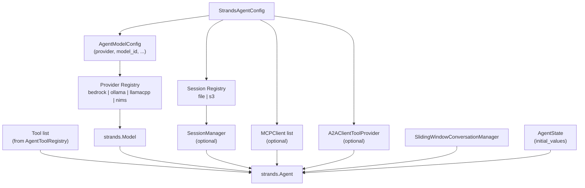

# Factory Wiring

How `StrandsAgentFactory.create_agent` assembles a `strands.Agent`.

`create_agent` is the main entry point; `create_agent_with_tool_registry`
and `create_agent_with_mcp_clients` are convenience variants.  All three
delegate to the same internal assembly path.  Provider and session manager
factories are registered at class initialisation and can be extended via
`register_model_provider` and `register_session_manager`.
