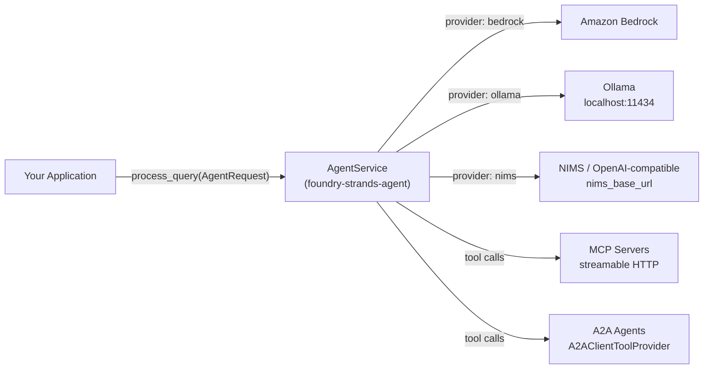

# System Context

Where `foundry-strands-agent` fits in your stack.

Your application calls `AgentService.process_query` with an `AgentRequest`.
The service creates a `strands.Agent` configured for the selected provider,
attaches all registered tools, and runs the autonomous agent loop.  Your
application never talks to the model endpoint or tool backends directly.
